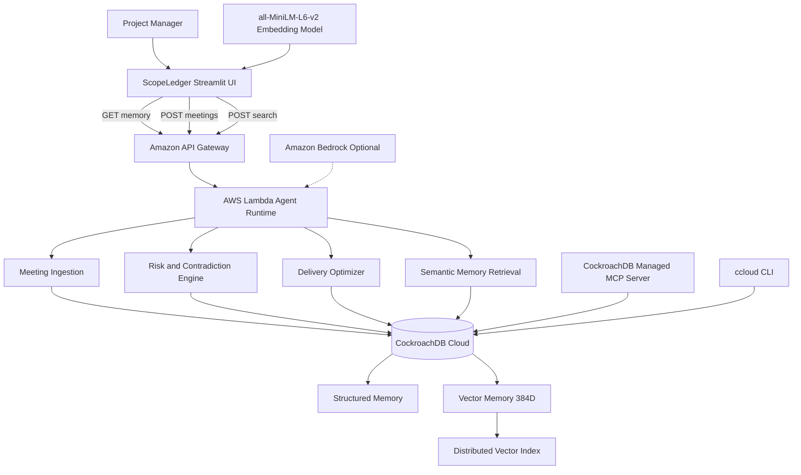

# ScopeLedger

ScopeLedger is an evidence-backed project memory agent for client delivery teams.

It turns meeting history into persistent project memory, detects delivery risks and scope changes, retrieves relevant historical evidence semantically, and generates deterministic budget/deadline planning options.

## Problem

Important client decisions are often spread across meeting notes, chat threads, and individual memory.

This leads to:

- forgotten commitments
- scope creep
- conflicting project assumptions
- missed deadline risks
- budget pressure
- weak auditability

ScopeLedger maintains a longitudinal source of project truth instead of treating each meeting independently.

## What ScopeLedger remembers

- meetings
- decisions
- commitments
- owners and deadlines
- scope requests and approvals
- project changes
- budget and deadline state
- original evidence
- semantic vector memories

## Architecture

### Architecture principles

- **CockroachDB is the system of record** for persistent agent memory.
- **AWS Lambda is the agent execution layer** for ingestion, retrieval, risk analysis, and optimization.
- **Distributed Vector Indexing** powers semantic retrieval over historical project evidence.
- **CockroachDB Managed MCP** provides agent access to live project memory.
- **ccloud CLI** is used for CockroachDB Cloud operational inspection and management.
- **Amazon Bedrock is optional** and is not required for the core ScopeLedger workflow.

CockroachDB Managed MCP provides agent access to the live project memory.

## AWS usage

ScopeLedger uses:

- AWS Lambda for serverless agent execution
- Amazon API Gateway for the backend HTTP API
- CloudWatch for Lambda execution logs

Amazon Bedrock was designed as an optional enhancement for natural-language extraction and reasoning, but the core application does not depend on it.

## CockroachDB usage

ScopeLedger uses CockroachDB as the persistent agent-memory layer.

Key CockroachDB capabilities demonstrated:

- Distributed Vector Indexing
- CockroachDB Cloud Managed MCP Server
- ccloud CLI
- structured SQL memory across meetings
- semantic similarity search over project evidence

### Semantic memory

Meeting evidence is embedded using:

`sentence-transformers/all-MiniLM-L6-v2`

The resulting 384-dimensional embeddings are stored in:

`VECTOR(384)`

CockroachDB performs cosine-distance semantic retrieval over historical evidence.

Example question:

> What did the client say about the launch timeline?

ScopeLedger retrieves relevant deadline evidence across multiple meetings even when the query does not contain the exact wording used in the original notes.

### Project reasoning

ScopeLedger combines semantic retrieval with deterministic project logic.

Examples:

- What is the budget?
- Can we manage the budget?
- Can we still hit the deadline?
- What extra work could affect the schedule?

Planning questions can use:

- current budget
- available capacity
- approved scope
- pending scope
- estimated engineering effort
- historical evidence

ScopeLedger produces three delivery strategies:

- Protect Budget
- Protect Deadline
- Balanced

## Run locally

Create a Python virtual environment and install dependencies:

```bash
python -m venv .venv
source .venv/bin/activate
pip install -r requirements.txt
```

Create a `.env` file containing:

```
DATABASE_URL=...
SCOPELEDGER_API_URL=...
SCOPELEDGER_WRITE_KEY=...
```

Do not commit `.env`.

Run:

```bash
python -m streamlit run app.py
```

## Repository structure

```text
scopeledger/
├── app.py
├── requirements.txt
├── scripts/
│   ├── init_db.py
│   ├── setup_vectors.py
│   ├── backfill_vectors.py
│   ├── semantic_search_test.py
│   └── ...
└── README.md
```

## Demo project

The included demo follows a Website Redesign project for Acme Corp.

ScopeLedger remembers changes across multiple meetings including:

- $10,000 project budget
- September 30 launch deadline
- authentication commitment
- CSV export approval
- additional development effort
- mobile support deferral
- analytics dashboard request
- dark mode request

## Security

Secrets are loaded from environment variables and excluded from Git through `.gitignore`.

The public repository should contain only synthetic demo project data.

## Status

Hackathon MVP.
